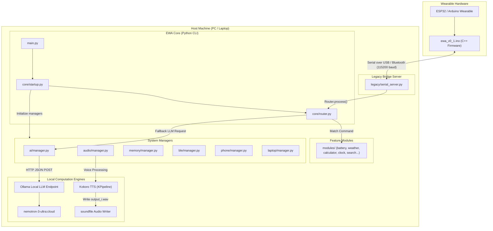

# EWA Core 🤖🎙️⌚
> **Ecosystem Wearable Assistant (EWA) – V0.1 Alpha**

EWA Core is the host and communication runtime for **EWA**, the wearable AI assistant of the **AVATAR ecosystem**. This system integrates local LLM execution, low-latency device control, neural Text-to-Speech (TTS), and physical wearable hardware interactions into a modular, privacy-first companion.

---

## 🏗️ System Architecture

EWA Core is designed with a decoupled architecture containing firmware running on the wearable device, an interactive bridge runner on the host, and structured manager packages handling local speech synthesis, LLM queries, and hardware communication.



---

## 🔄 Interaction Flowchart

Below is the execution flow showing how commands are received, routed, processed by the local LLM or modular skill systems, and synthesised back to audio outputs.

```mermaid
flowchart TD
    Start([User Interaction]) --> ChooseMode{Select Interface}
    ChooseMode -->|Host CLI Terminal| CliInput[User inputs prompt in terminal]
    ChooseMode -->|Wearable Watch| SerialInput[User sends command via Serial]

    SerialInput --> SerialServer[serial_server.py receives command]
    SerialServer --> Router[core/router.py process()]

    CliInput --> MainLoop[main.py interactive EWA loop]
    MainLoop --> ChatCall[ai.manager.chat()]

    Router --> RouteCheck{Is it a local module command?}
    RouteCheck -->|Yes: time, battery, weather...| ExecModule[Execute module.handle()]
    RouteCheck -->|No: natural language prompt| AskLLM[Query local Ollama client]

    ChatCall --> AskLLM

    AskLLM --> CallOllama[POST request to /api/generate]
    CallOllama --> GetResponse[Receive Nemotron-3-Ultra response]
    GetResponse --> UserOutput[Display response to user]

    UserOutput --> TestVoice{Run Speech Synth?}
    TestVoice -->|Yes: test_voice.py| KokoroTTS[Run Kokoro KPipeline]
    KokoroTTS --> GenWav[Save output_i.wav via soundfile]
    GenWav --> End([Done])
    TestVoice -->|No| End
```

---

## 🛠️ Technology Stack & Libraries

EWA Core coordinates several advanced open-source frameworks and low-level communication libraries:

| Layer | Technology / Library | Language | Purpose |
| :--- | :--- | :--- | :--- |
| **Wearable Firmware** | Arduino / ESP32 C++ | `C++` | Handles physical inputs, screen rendering, and Serial/BLE telemetry. |
| **Core Runtime** | Python 3.10+ | `Python` | Orchestrates the managers, schedules services, and executes system integrations. |
| **LLM Orchestration** | Ollama | `Go` / `API` | Local AI inference engine managing the `nemotron-3-ultra:cloud` model. |
| **HTTP Client** | `requests` | `Python` | Performs non-blocking queries to Ollama's local web server API. |
| **Neural TTS** | Kokoro (`kokoro`) | `Python` | Ultra-fast local voice generation using deep neural sound structures. |
| **Audio Writing** | SoundFile (`soundfile`) | `C++ / Python` | Output generation and encoding of synthesized waveforms to high-quality `.wav` files. |
| **Serial Bus Bridge** | PySerial (`serial`) | `Python` | Facilitates real-time duplex data streaming with microcontroller over serial COM ports. |

---

## 📂 Project Directory Structure

```filepath
EWA-Core/
├── main.py                 # Core startup entrypoint. Runs start() from core/startup.py
├── config.py               # System-wide configuration (endpoints, active model models)
├── requirements.txt        # Python external library list
├── test_voice.py           # Verification script for local Kokoro TTS pipeline
├── core/                   # Kernel and orchestration layer
│   ├── startup.py          # Sequence to boot up and initialize memory, AI, audio, BLE, and peripherals
│   ├── router.py           # Evaluates commands to dispatch local skills or forward prompts to the LLM
│   ├── events.py           # Event-loop hooks for asynchronous systems
│   └── constants.py        # System constants and parameters
├── ai/                     # Artificial Intelligence Manager
│   ├── manager.py          # Coordinates AI state and exports standard chat interface
│   ├── ollama_client.py    # Integrates prompt formatting, EWA identity limits, and HTTP requests to Ollama
│   ├── models.py           # Model definitions and prompt interfaces
│   └── prompts.py          # Custom prompt definitions
├── audio/                  # Audio I/O and Synthesis
│   ├── manager.py          # Coordinates microphone input and speaker output streams
│   ├── tts.py              # Text-to-Speech logic
│   ├── stt.py              # Speech-to-Text logic
│   └── wakeword.py         # Handles offline wake word detection ("EWA")
├── memory/                 # Short/Long-Term Memory Manager
│   ├── manager.py          # Coordinates databases, profile, and history state
│   ├── database.py         # SQLite / Vector DB storage operations
│   ├── history.py          # Tracks local conversation logs
│   ├── profile.py          # Stores active user identity parameters
│   └── preferences.py      # Configures user settings
├── ble/                    # Bluetooth Low Energy Controller
│   ├── manager.py          # Initializes adapter and handles pairing
│   ├── client.py           # Establishes connections to wearable client peripherals
│   ├── devices.py          # Discovers and maps nearby wearable hardware profiles
│   └── protocol.py         # Encapsulates Bluetooth transport protocols
├── modules/                # Custom command modules / system features
│   ├── battery.py          # Monitors local battery values
│   ├── weather.py          # Resolves local meteorological updates
│   ├── calculator.py       # Local math parsing
│   ├── clock.py            # Local date/time parameters
│   ├── search.py           # Dispatches queries to web tools
│   ├── reminders.py        # Creates and checks task reminders
│   ├── internet.py         # Network diagnostic helper
│   └── notifications.py    # Push messaging interfaces
├── services/               # Background Daemons
│   ├── ble_service.py      # Background Bluetooth monitoring service
│   ├── scheduler_service.py# Runs cron-like tasks (alarms, timed reminders)
│   ├── update_service.py   # Synchronizes system files
│   └── startup_service.py  # System boot parameters
├── firmware/               # Microcontroller firmware
│   └── watch/
│       └── ewa_v0_1/
│           └── ewa_v0_1.ino # Main Arduino C++ firmware sketch for the wearable
├── legacy/                 # Relic / Bridge server scripts
│   └── serial_server.py    # Standard COM-port relay server to run host system via physical connection
└── tests/                  # Automated verification tests
    ├── test_ai.py          # Unit tests for Ollama requests and prompting
    ├── test_ble.py         # Unit tests for Bluetooth handlers
    ├── test_router.py      # Unit tests for router logic
    └── test_modules.py     # Unit tests for calculator, weather, clock, etc.
```

---

## ⚙️ Installation & Setup

Follow these steps to configure your host machine and wearable hardware:

### 1. Prerequisites
- **Python 3.10+**: Ensure Python is added to your environment `PATH`.
- **Arduino IDE**: For compiling and flashing the wearable firmware.
- **Ollama**: Installed and running on the host system.

### 2. Local Ollama LLM Setup
1. Download Ollama from the [official website](https://ollama.com).
2. Install and launch the Ollama app on your host machine.
3. Pull the configured EWA LLM model:
   ```bash
   ollama pull nemotron-3-ultra:cloud
   ```
4. Verify the Ollama web service is active at `http://localhost:11434`.

### 3. Python Environment Setup
1. Navigate to the root directory and create a virtual environment:
   ```bash
   python -m venv .venv
   ```
2. Activate the virtual environment:
   - **Windows (PowerShell)**:
     ```powershell
     .venv\Scripts\Activate.ps1
     ```
   - **macOS / Linux**:
     ```bash
     source .venv/bin/activate
     ```
3. Install all required dependencies:
   ```bash
   pip install -r requirements.txt
   ```

### 4. Wearable Firmware Upload
1. Open the [Arduino IDE](https://www.arduino.cc/en/software).
2. Open the main firmware sketch: `firmware/watch/ewa_v0_1/ewa_v0_1.ino`.
3. Connect your wearable device (ESP32/Arduino) to the host via a USB cable.
4. Select the corresponding **Board** and **Port** from the Arduino IDE Tools menu.
5. Click **Upload** (right arrow icon) to flash the firmware onto the watch.

---

## 🚀 Running the Application

### A. Run interactive EWA CLI (Host Loop)
Make sure Ollama is running, then execute `main.py`:
```bash
python main.py
```
This loads all managers and enters the EWA prompt loop:
```text
==================================================
EWA Core V0.1 Alpha
==================================================
[1/6] Loading Memory...
   Memory Manager Ready
[2/6] Loading AI...
   AI Manager Ready
[3/6] Loading BLE...
   BLE Manager Ready
[4/6] Loading Audio...
   Audio Manager Ready
[5/6] Loading Phone...
   Phone Manager Ready
[6/6] Loading Laptop...
   Laptop Manager Ready

===================================
EWA Core Ready.
===================================

EWA > Hello, who are you?

Thinking...

EWA : I'm EWA, your wearable AI assistant.
```

### B. Test Speech Synthesis (Kokoro Neural TTS)
Run the dedicated test script to generate speech offline:
```bash
python test_voice.py
```
This will initialize the local `KPipeline` sound pipeline, process the text payload, and write `output_0.wav` to the project root directory.

### C. Run the Wearable Communication Bridge
To orchestrate messages between the physical wearable watch and the host machine over serial, execute:
```bash
python legacy/serial_server.py
```
*Note: You may need to edit `legacy/serial_server.py` and replace `"COM9"` with the active port of your wearable device.*
